# Certified Tester Foundation Level (CTFL) v4.0 [NEW!]

Este repositório contém conteudos e resumos, focados em testes e QA, que aprendi durante o estudo para a certificação CTFL 4.0 e outras certificações do [ISTQB](https://www.istqb.org/).

O conteúdo está **_numerado_** de acordo com os topicos abordados no Syllabus desta versão do CTFL

O exame tem os seguintes domínios do conteúdo e ponderações:

| Capítulos | Questões | Percentagem |
| --------- | -------- | ----------- |
| 1         | 8        | 26.67%      |
| 2         | 6        | 20.00%      |
| 3         | 4        | 13.33%      |
| 4         | 11       | 36.67%      |
| 5         | 9        | 30.00%      |
| 6         | 2        | 6.67%       |
|           | 40       |             |

**Capítulo 1:** Fundamentos dos Testes

**Capítulo 2:** Testes ao longo do ciclo de vida de desenvolvimento de software

**Capítulo 3:** Teste Estático

**Capítulo 4:** Análise e Projeto de Teste

**Capítulo 5:** Gerenciando as atividades de teste

**Capítulo 6:** Ferramentas de Teste

Contribuições são bem-vindas! Sinta-se à vontade para abrir uma issue ou enviar um pull request com melhorias ou correções.

## 1.1 O que é Teste?

Conjunto de atividades para:

- Descobrir defeitos
- Avaliar a qualidade dos artefatos de software

> _Artefatos de software_ = De acordo com ISTQB, Objetos de teste ou software alvo de teste (o produto de trabalho a ser testado)

> _Objetos de teste:_ Amplo

> _Itens de teste:_ As funções dos objetos de teste, por exemplo: Site de banco(Objeto de teste) a função de ver saldo (Item de teste).

## Verificação x Validação

**_Verificação:_**
”Estamos construindo o produto corretamente?”
• O software deve estar de acordo com sua especificação, os requisitos especificados na estória

**_Validação:_**
”Estamos construindo o produto certo?”
• O software deve fazer o que o usuário realmente deseja

De nada adianta um software que segue todos os requisitos especificados nas estórias do usuário, se o mesmo no dia-a-dia operacional da empresa não atende as necessidades dos usuários.

> Ex: Um software que cumpre todos os requisitos especificados, mas é lento demais para certas tarefas do dia-a-dia.

## Testes estáticos x Testes dinâmicos

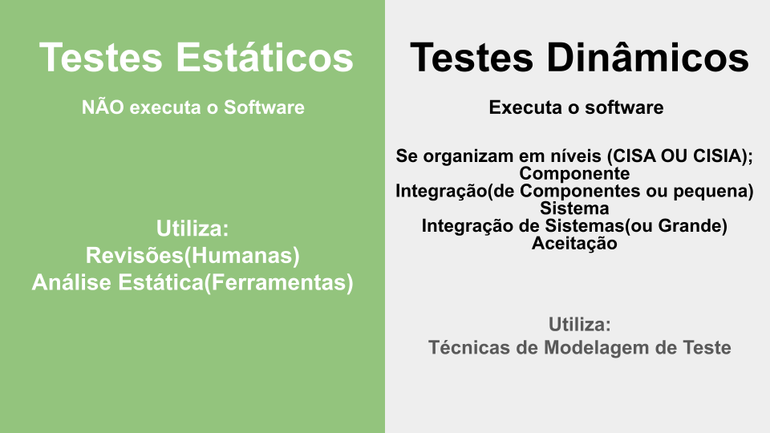

Teste de (Unidade, Unitário e Componente) são os mesmos, e na prova também são, de acordo com o glossário.

> A parte mínima de um sistema que pode ser testado isoladamente.

Teste de uma ou mais unidades(componentes) juntas, é um Teste de integração, ou Teste de integração de componentes

## Imagem Resumo

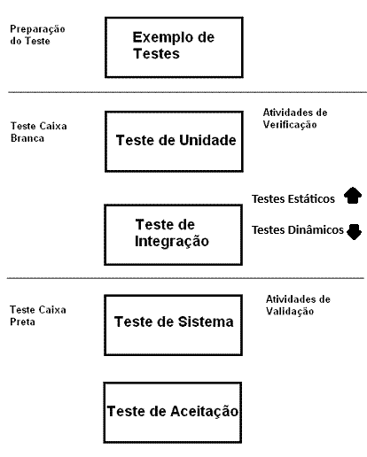

## 1.1.1 Objetivos do teste

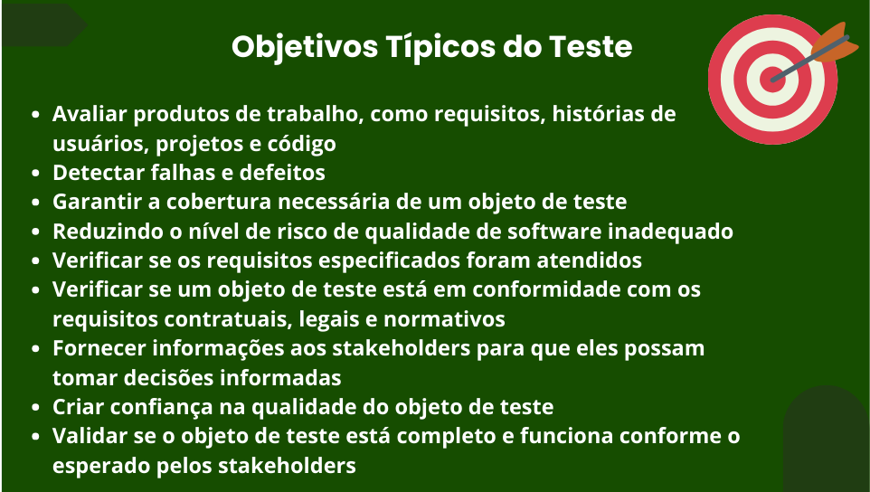

**Os objetivos típicos do teste são:**

- Avaliar produtos de trabalho, como requisitos, histórias de usuários, projetos e código;
- Detectar falhas e defeitos;
- Garantir a cobertura necessária de um objeto de teste;
- Reduzindo o nível de risco de qualidade de software inadequado;
- Verificar se os requisitos especificados foram atendidos;
- Verificar se um objeto de teste está em conformidade com os requisitos contratuais, legais e
  normativos;
- Fornecer informações aos stakeholders para que eles possam tomar decisões informadas;
- Criar confiança na qualidade do objeto de teste;
- Validar se o objeto de teste está completo e funciona conforme o esperado pelos
  stakeholders.

### Comentários:

- **_Detectar falhas e defeitos_**
  1. Defeito: o que ocorre no processo de desenvolvimento do software ou nas atividades de **Verificação**, que se caso seja um erro na codificação pode tornar-se um Erro.
  2. Falha: o que ocorre quando o software está em produção, nas atividades de **Validação**, quando o software apresenta comportamento e respostas diferentes do esperado, afetando diretamente a experiência do usuário final.
- **_Garantir a cobertura necessária de um objeto de teste_**
  1. Cobertura de teste: Ela mede o percentual de linhas testadas, ou seja, quantidade de linhas testadas dividido pelo total de linhas de código.

## 1.1.2 Teste e Depuração

### O teste e a depuração são atividades distintas

O teste pode desencadear falhas causadas por defeitos de software(teste dinâmico) ou pode encontrar defeitos diretamente no objeto de teste (teste estático).

Quando o teste dinâmico aciona uma falha, a **Depuração** se preocupa em encontrar as causas dessa falha(defeitos),analisar essas causas e eliminá-las.

### Processo típico de Depuração(debugging)

1. Reproduzir uma falha
2. Diagnosticar(encontrar a causa principal)
3. Corrigir a causa

**Teste de confirmação:** verificar se as correções resolveram o problema

**Teste de regressão:** verificar se a correção de um problema não ocasionou falhas em outras partes do objeto de teste.

## 1.2 Por que os testes são necessários?

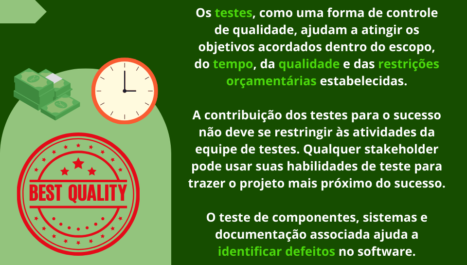

## 1.2.1 Contribuições para o sucesso dos testes

## 1.2.2 Testes e Garantia da Qualidade (QA)

### Teste e QA não são a mesma coisa

- **QA (Quality Assurance ou Garantia da Qualidade)**
  1. Um QA tem o papel um pouco mais amplo do que o de um Tester , deve garantir que todo o processo de desenvolvimento de software esteja dentro dos melhores padrões e práticas que levam à melhor qualidade.
- **Tester (Analista de teste)**
  1. O analista de teste tem como maior objetivo a execução de testes para identificar algum problema ou falha no software. Concentrando seus esforços em testes manuais e automatizados, entre outros.

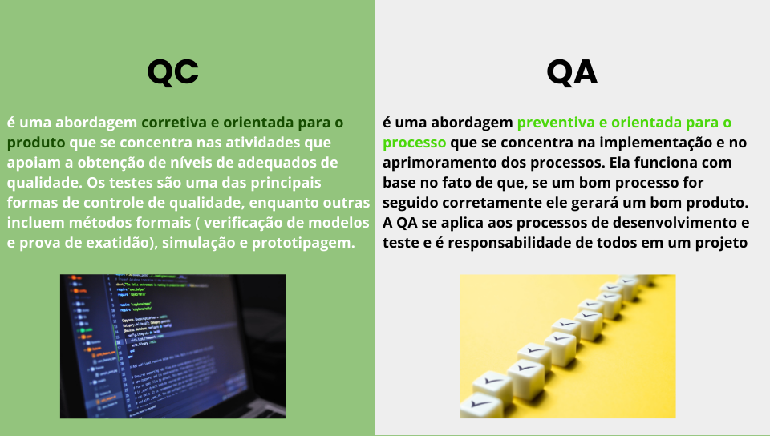

## 1.2.3 Erros, Defeitos, Falhas e Causas raiz

> **\*A mesma coisa** porém em momentos diferentes como uma borboleta(lagarta, casulo, borboleta)\*

**Erro(equívoco, engano):** Ação humana que produz um resultado incorreto.

**Causa-Raiz:** Uma fonte de um defeito tal que, se ele for removido, a ocorrência do tipo do defeito é reduzida ou removida.

**Defeito(Falta, bug):** Uma imperfeição ou deficiência em um produto de trabalho que não atende aos seus requisitos ou especificações ou prejudica o uso pretendido.

**Falhas(Problema):** Um evento em que um componente ou sistema não atende a seus requisitos dentro dos limites especificados.

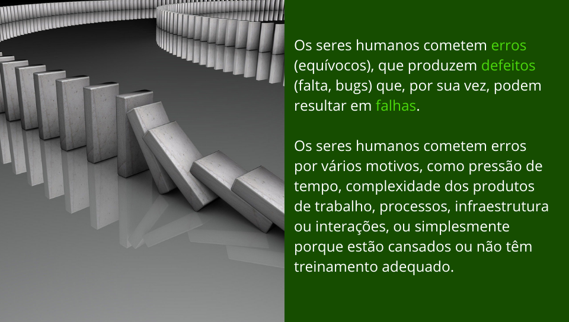

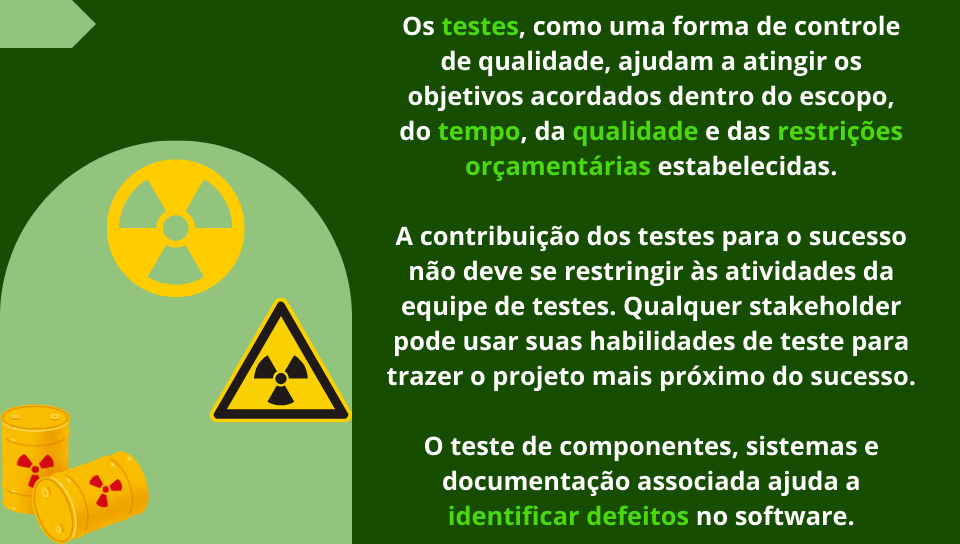

Os erros e defeitos não são a única causa de falhas.

As falhas também podem ser causadas por condições ambientais, como quando a radiação ou o campo eletromagnético causam defeitos no firmware.

## 1.3 Princípios de teste

> **São 7 Fundamentos(Princípios) de teste.**

1. **_O teste mostra a presença, não a ausência de defeitos._** Questão de cobertura de teste: 100% de cobertura de testes é igual a garantia completa da qualidade?
2. **_Testes exaustivos são impossíveis._** Testar todas as possibilidades de **entradas** é impossível ,exceto em softwares muitos pequenos.
3. **_Testes antecipados economizam tempo e dinheiro._** Regra 10 de Myers ou Shift-left
4. **_Os defeitos se agrupam._** Regra 80/20( Princípio de Pareto)
5. **_Os testes se degradam._** Se eu testar sempre do mesmo jeito, logo menos os testes não serão mais eficazes para encontrar bugs (Paradoxo do pesticida)
6. **_Os testes dependem do contexto._** Não existe uma única abordagem universalmente
   aplicável aos testes. Os testes são feitos de forma diferente em contextos diferentes . 100 horas para teste em uma Aeronave(Navegação, Entretenimento), Análise de risco.
7. **_Falácia da ausência de defeitos._** Além da verificação, a validação também deve ser realizada.

## 1.4 Atividades de teste, Testware e Papéis no teste

O teste depende do **contexto**, mas, em um nível elevado, há **conjuntos comuns de atividades de teste** sem os quais é menos provável que o teste atinja seus objetivos. Esses conjuntos de atividades de teste formam um **processo de teste.**

Processo de teste:

> O conjunto de atividades inter-relacionadas que inclui planejamento de teste, monitoramento e controle de teste, análise de teste, modelagem de teste, implementação de teste, execução de teste e conclusão de teste.

## 1.4.1 Atividades e Tarefas de Teste

Um **processo de teste** geralmente consiste nos principais grupos de atividades descritos abaixo.

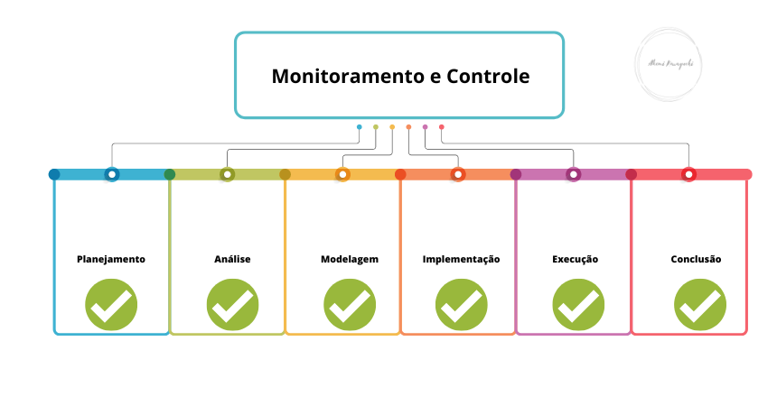

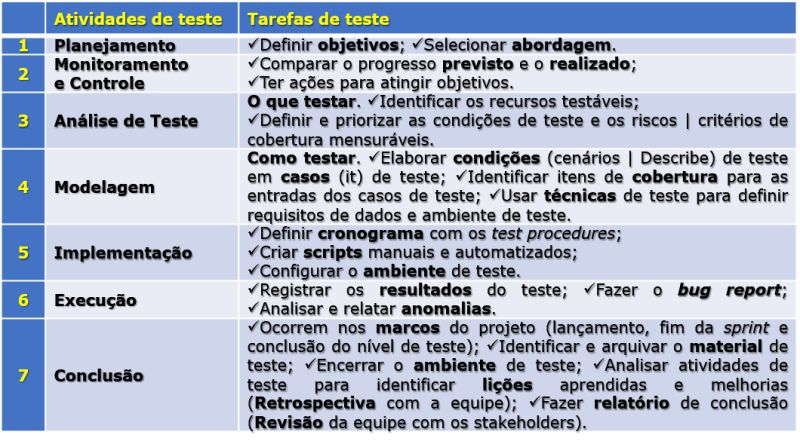

**_Atenção:_**

**Monitoramento x Controle:**

Monitoramento: envolve a verificação contínua de todas as atividades de teste e a comparação do progresso real com o plano

Controle: controle do teste envolve a tomada das ações necessárias para atingir os objetivos do teste.(Caso as atividades de teste não estejam atingindo o plano)

**Execução do Teste:**

Execução dos testes e gerenciamento dos defeitos que aparecerem.

**Modelagem x Implementação:**

Os procedimentos de testes, com o cronograma de execução dos testes(ordem) é apenas na **Implementação**.

**Projeto de teste ou Modelagem:**

A mesma coisa.

## 1.4.2 Processo de teste no contexto

Os **testes não são realizados de forma isolada**. As atividades de teste são parte integrante dos processos de desenvolvimento executados em uma organização. Os testes são financiados pelos stakeholders e seu objetivo final é **ajudar a atender às necessidades de negócio** deles.

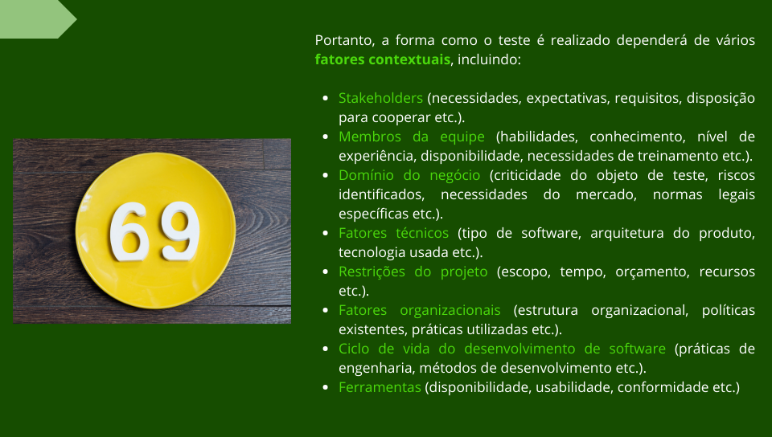

## 1.4.3 Testware

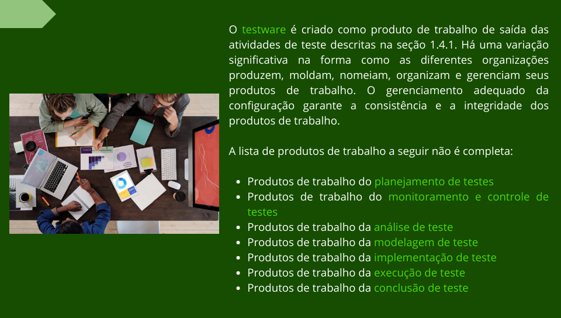

## 1.4.4 Rastreabilidade entre a Base de teste e o Testware

> **_Rastreabilidade:_** Entender quais foram os requisitos geradores, o que inspirou(Base de teste) os testes a serem criados, e o contrário, quais testes foram criados(Testware), e quais resultados foram produzidos a partir desses requisitos/estórias

Além de avaliar a cobertura, uma boa rastreabilidade permite determinar o impacto das mudanças, facilita as auditorias de teste e ajuda a atender os critérios de governança de TI.

A boa rastreabilidade também torna o progresso do teste e os relatórios de conclusão mais
compreensíveis, incluindo o status dos elementos da base de teste. Isso também pode ajudar a
comunicar os aspectos técnicos dos testes aos stakeholders de uma maneira compreensível.

A rastreabilidade auxilia a parte de Monitoramento e controle do processo de teste

A rastreabilidade fornece informações para avaliar a qualidade do produto, a capacidade do
processo e o progresso do projeto em relação aos objetivos de negócio.

## 1.4.5 Papéis no Teste

  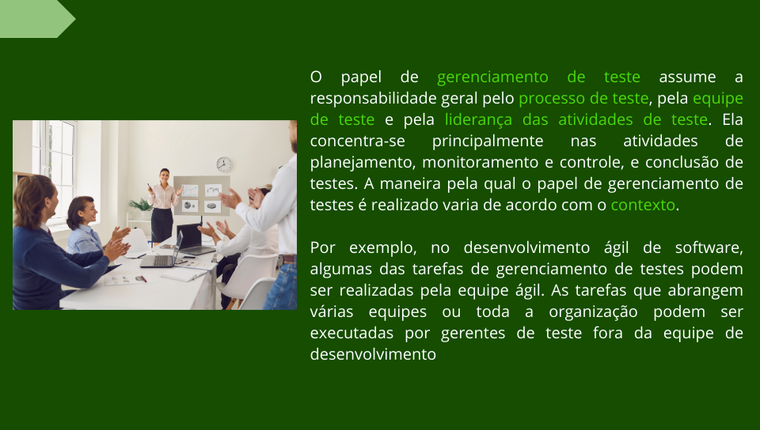
  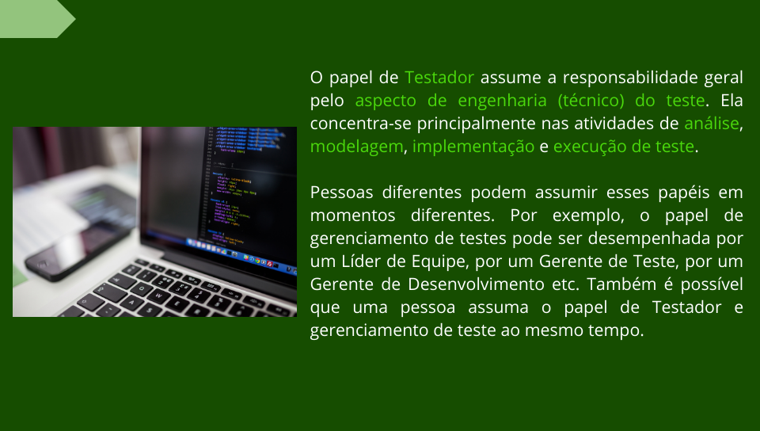 

## 1.5 Habilidades essenciais e boas práticas em testes

Soft skills até 1.5.2

## 1.5.1 Habilidades genéricas necessárias para testes

## 1.5.2 Abordagem de equipe completa

## 1.5.3 Independência dos testes

  
  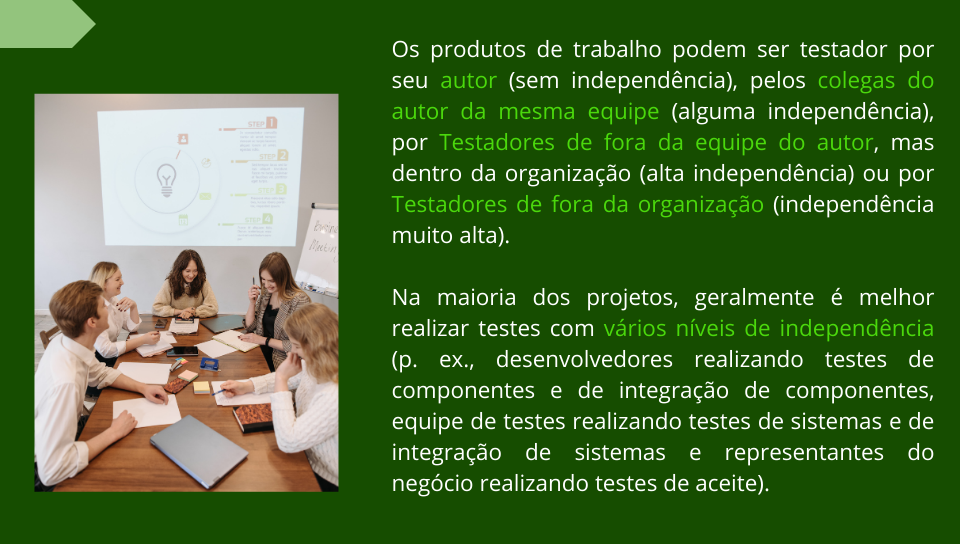 

**Testadores independentes** provavelmente reconhecerão **diferentes tipos de falhas e defeitos** em comparação com os desenvolvedores, devido às suas diferentes formações, perspectivas técnicas e preconceitos.

Há também algumas **desvantagens**. Os Testadores independentes podem ficar **isolados** da equipe de desenvolvimento, o que pode levar à **falta de colaboração**, a **problemas de comunicação** ou a uma **relação adversa** com a equipe de desenvolvimento.

## 2.Testes ao longo do Ciclo de Vida de Desenvolvimento de Software (SDLC)

## 2.1 Testes no contexto de um CVDS(SDLC)

> Um modelo de ciclo de vida de desenvolvimento de software (SDLC) é uma representação abstrata e de alto nível do processo de desenvolvimento de software.

Um modelo SDLC define como as diferentes fases de desenvolvimento e os tipos de atividades realizadas nesse processo se relacionam entre si, tanto lógica quanto cronologicamente.

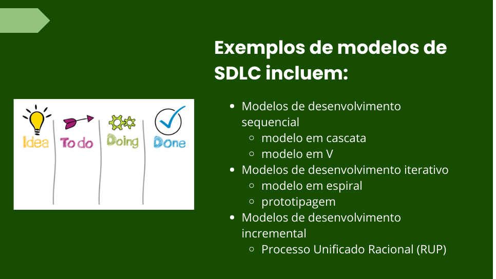

Algumas **_atividades_** nos processos de desenvolvimento de software também podem ser descritas
por **_métodos de desenvolvimento de software_** mais detalhados e práticas ágeis.

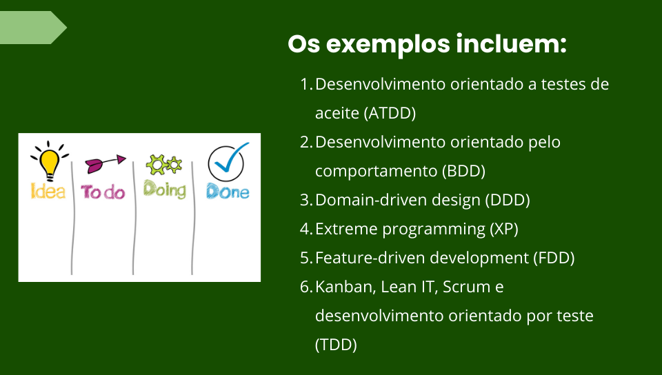

- **_Observação_**
  Modelos de SDLC iterativos(loop) **E** incrementais, são ágeis (SCRUM, Kanban).

## 2.1 Impacto do CVDS nos Testes

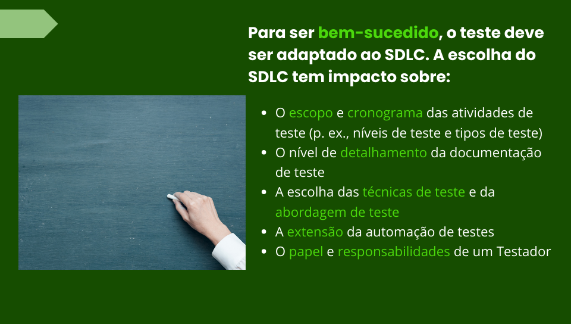

Nos modelos de **desenvolvimento sequencial**, nas fases iniciais, os Testadores normalmente
participam das revisões de requisitos, da análise de testes e do projeto(modelagem) de testes. O código executável geralmente é criado nas fases posteriores, portanto, os testes dinâmicos não podem ser realizados no início do SDLC.

Em alguns modelos de **desenvolvimento iterativos e incrementais**, supõe-se que cada iteração
entregue um protótipo funcional ou um incremento de produto. Isso implica que, em cada iteração, os testes estáticos e dinâmicos podem ser realizados em **todos os níveis de teste**. A entrega frequente de incrementos exige feedback rápido e testes de regressão extensivos.

O Desenvolvimento Ágil de Software pressupõe que podem ocorrer mudanças ao longo do projeto.
Portanto, a documentação leve do produto de trabalho e a ampla automação de testes para facilitar os testes de regressão são favorecidas em projetos Ágeis. Além disso, a maior parte dos testes manuais tende a ser feita usando técnicas de teste baseadas na experiência (ver seção 4.4) que não exigem análise e projeto(modelagem) de teste prévio extensivo.

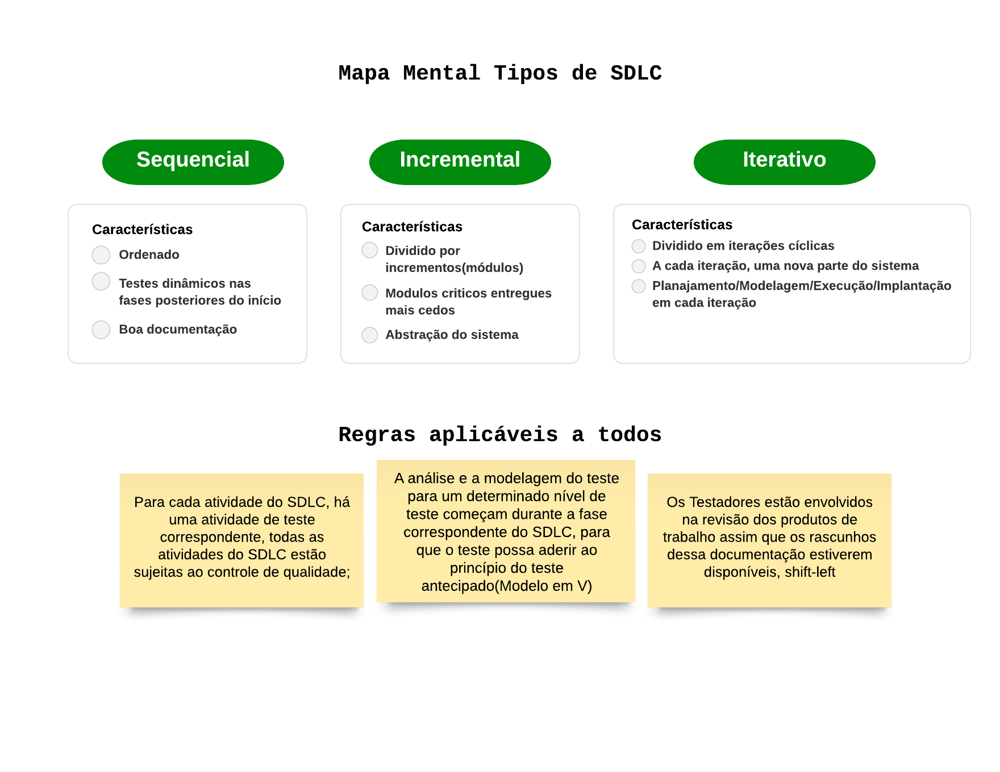

## 2.1.2 CVDS e Boas práticas de Teste

  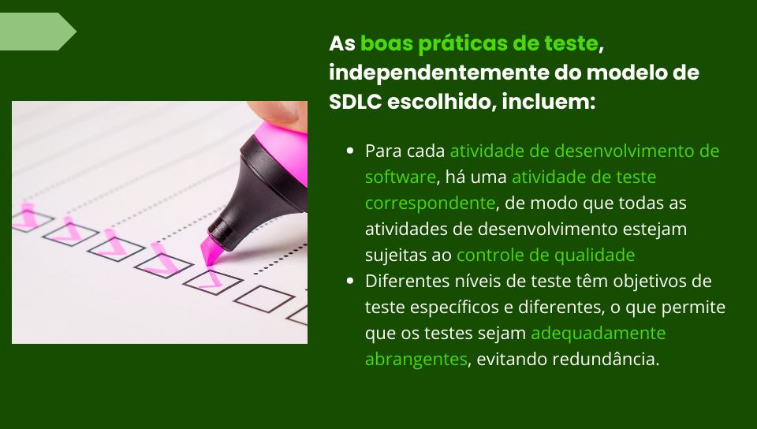
  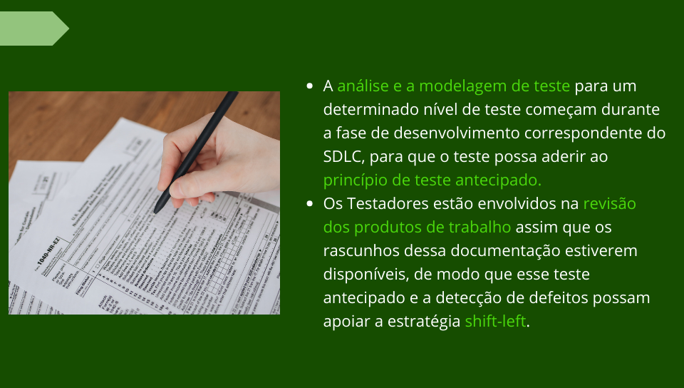 

## 2.1.3 Teste como um motivador para o desenvolvimento de software

**O TDD, ATDD e BDD são abordagens de desenvolvimento semelhantes, em que os testes são
definidos como um meio de direcionar o desenvolvimento.**

Cada uma dessas abordagens implementa o princípio do teste antecipado e segue uma abordagem shift-left, pois os testes são definidos antes de o código ser escrito. Elas dão suporte a um modelo de desenvolvimento iterativo. Essas abordagens são caracterizadas da seguinte forma:

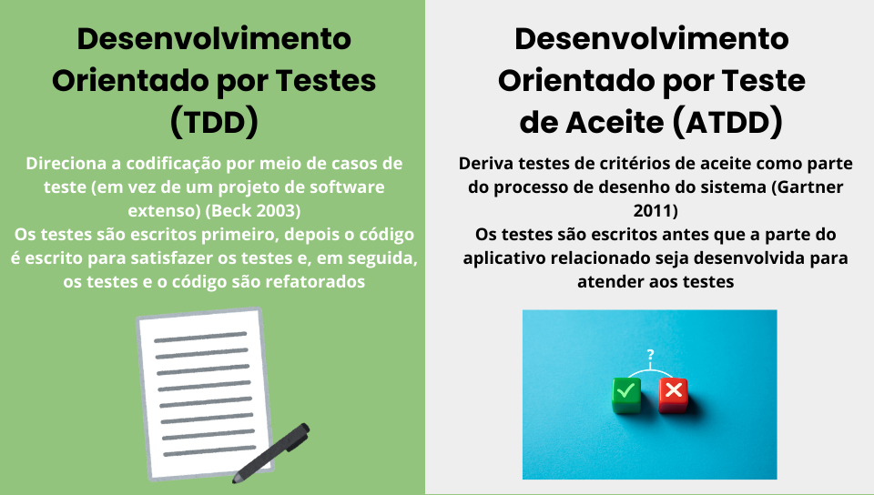

Para todas as abordagens acima, os testes podem persistir como testes automatizados para garantir a qualidade do código em futuras adaptações/refatoração.

## 2.1.4 DevOps e Testes

O DevOps promove a autonomia da equipe, feedback rápido, cadeias de ferramentas
integradas e práticas técnicas como **Integração Contínua** (CI) e **Entrega Contínua** (CD).

Isso permite que as equipes criem, testem e liberem códigos de alta qualidade mais rapidamente por meio de um **pipeline de entrega** de DevOps (Kim 2016).

  
  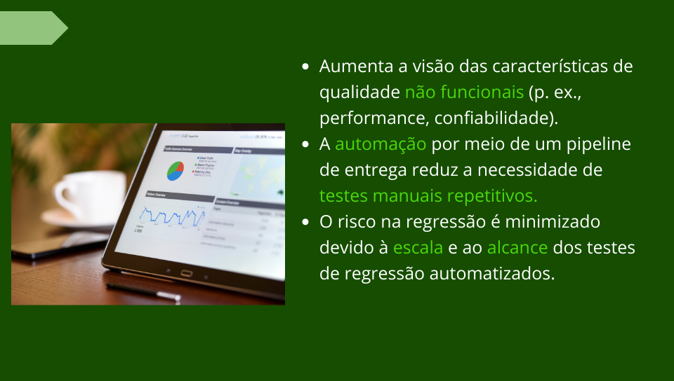 

O DevOps tem seus riscos e desafios, que incluem:
• O **pipeline de entrega** de DevOps deve ser definido e estabelecido;
• As **ferramentas** de CI/CD devem ser introduzidas e mantidas;
• A **automação de testes** requer recursos adicionais e pode ser difícil de estabelecer e manter.

Embora o DevOps venha com um alto nível de testes automatizados, os **testes manuais** -
especialmente da perspectiva do usuário - **ainda serão necessários**.

## 2.1.5 Abordagem Shift-Left

O princípio do **teste antecipado** às vezes é chamado de **shift-left** porque é uma abordagem em que o teste é realizado **mais cedo** no SDLC.

Normalmente, o shift-left sugere que os testes devem ser feitos mais cedo (p. ex., não esperar que o código seja implementado ou que os componentes sejam integrados), mas isso não significa que os **testes posteriores** no SDLC devam ser negligenciados.

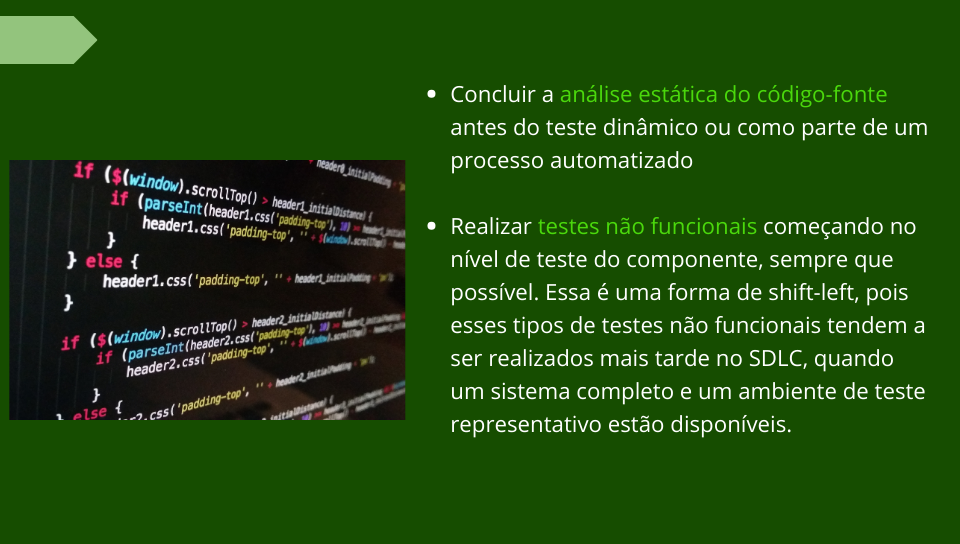

Uma abordagem shift-left pode resultar em treinamento, esforço e/ou custos adicionais no início do processo, mas espera-se que **economize** esforços e/ou custos no **final do processo**.

Para a abordagem shift-left, é importante que os stakeholders sejam convencidos a aceitarem esse conceito.

## 2.1.6 Retrospectivas e melhoria de processos

As retrospectivas (também conhecidas como "reuniões pós-projeto" e retrospectivas de projeto) geralmente são realizadas no final de um projeto ou de uma iteração, em um marco de lançamento, ou podem ser realizadas quando necessário. **_O momento e a organização das retrospectivas dependem do modelo específico de SDLC que está sendo seguido_**.

Nessas reuniões, os participantes (não apenas os Testadores, mas também, por exemplo, Desenvolvedores, Arquitetos, Product Owner, Analistas de Negócios) discutem:

**• O que foi bem-sucedido e deve ser mantido?**
**• O que não foi bem-sucedido e poderia ser melhorado?**
**• Como incorporar as melhorias e manter os sucessos no futuro?**

Os **resultados** devem ser registrados e normalmente fazem parte do **relatório de conclusão do teste**. As retrospectivas são essenciais para a implementações bem-sucedidas da melhoria contínua e é importante que todas as melhorias recomendadas sejam acompanhadas.

  
   

## 2.2 Níveis de teste e tipos de teste

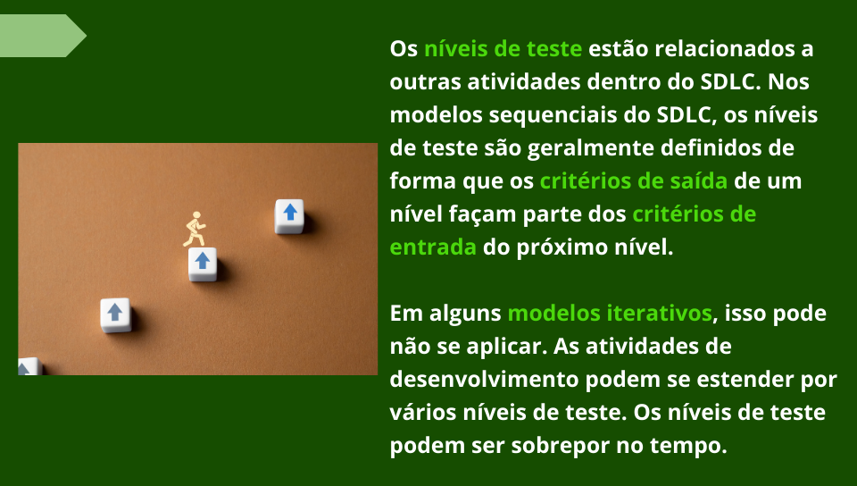

- **IMPORTANTE!**
  Níveis: Etapas/Quando
  Tipos: O que

## 2.2.1 Níveis de teste

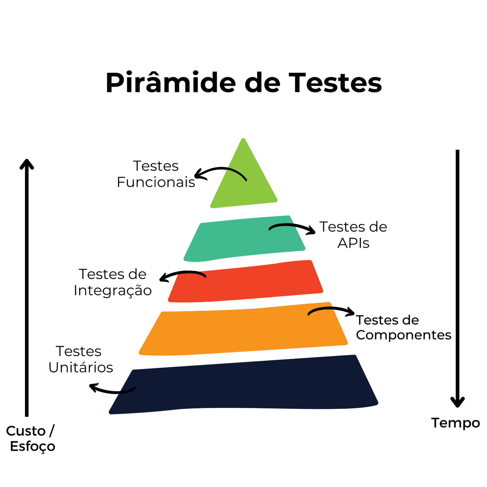

## 2.2.2 Tipos de teste

  
  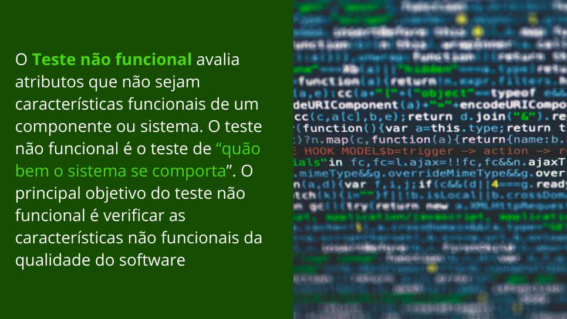 

Às vezes, é apropriado que os testes não funcionais comecem no início do ciclo de vida (p. ex., como parte de revisões e testes de componentes ou testes de sistema)

Muitos testes não funcionais são derivados de testes funcionais, pois usam os mesmos testes
funcionais, mas verificam se, ao executar a função, uma restrição não funcional é atendida (p. ex., verificar se uma função é executada dentro de um tempo especificado ou se uma função pode ser portada para uma nova plataforma).

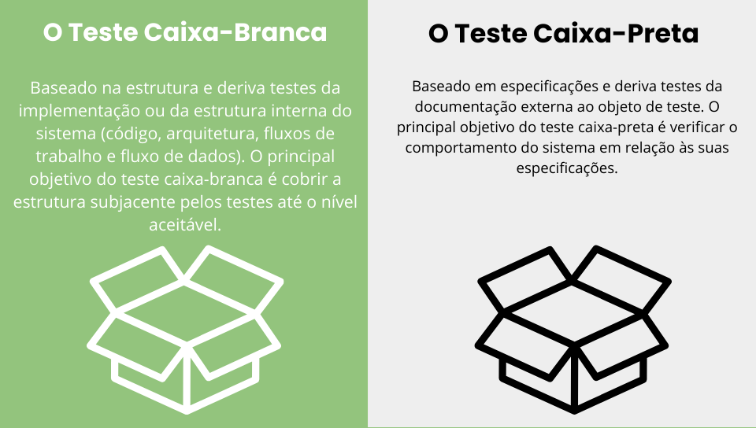

**TODOS os quatro tipos de teste** mencionados podem ser aplicados a todos os **níveis de teste**, embora o foco seja diferente em cada nível.

Diferentes técnicas de teste podem ser usadas para derivar **condições de teste** e **casos de teste** para todos os tipos de teste mencionados.

## 2.2.3 Testes de confirmação e regressão

Testes de confirmação e/ou testes de regressão para o objeto de teste são necessários em todos os níveis de teste se os defeitos forem corrigidos e/ou se forem feitas alterações nesses níveis de teste.

VER MAIS NO SYLLABUS

## 2.3 Teste de Manutenção

Há diferentes categorias de manutenção, que podem ser corretivas, adaptáveis a mudanças no
ambiente ou melhorar a performance ou a capacidade de manutenção (ver ISO/IEC 14764 para mais detalhes), portanto, a manutenção pode envolver versões/implantações planejadas e
versões/implantações não planejadas (hot fixes).

  
   

## 3.1 Noções básicas de teste Estático

Ao contrário dos testes dinâmicos, nos testes estáticos o software em teste não precisa ser
executado. O código, a especificação do processo, a especificação da arquitetura do sistema ou outros produtos de trabalho são avaliados por meio de **exame manual** (p. ex., revisões) ou com a **ajuda de uma ferramenta** (p. ex., análise estática).

Os objetivos do teste incluem:

- Detecção de defeitos
- Avaliar legibilidade
- Integridade
- Correção
- Testabilidade
- Consistência

> ***O teste estático pode ser aplicado tanto para verificação quanto para validação.***
> 

Testadores, representantes do negócio e desenvolvedores trabalham juntos durante o mapeamento de exemplos, escrita colaborativa de histórias de usuários e sessões de refinamento do backlog para garantir que as histórias de usuários e os produtos de trabalho relacionados atendam aos critérios definidos, por exemplo, a **Definição de Pronto** (DoR - Definition of Ready) (ver seção 5.1.3). 

Técnicas de revisão podem ser aplicadas para garantir critérios de aceite testáveis. 

A análise estática pode identificar problemas antes dos testes dinâmicos e, muitas vezes, exige menos esforço **(Shift-left)**, já que não são necessários casos de teste e, normalmente, são usadas ferramentas (ver capítulo 6). 

A análise estática é frequentemente incorporada às estruturas de CI.
Embora seja amplamente usada para detectar defeitos específicos no código, *a análise estática também é usada para avaliar a **capacidade de manutenção e a segurança***. Verificadores *ortográficos e ferramentas de legibilidade* são outros exemplos de ferramentas de análise estática.

## 3.1.1 Produtos de trabalho examináveis por testes estáticos

  
  

## 3.1.2 Valor do teste estático

**Valores resumidos:**

- O teste estático pode detectar defeitos nas primeiras fases do SDLC, cumprindo o **princípio do teste antecipado**.
- Ele também pode identificar defeitos que **não podem ser detectados por testes dinâmicos** (p. ex., código inacessível, padrões de projeto não implementados conforme desejado, defeitos em produtos de trabalho não executáveis).
- Menor custo geral, defeitos encontrados antes.
- Defeitos de código são detectados usando a análise estática, geralmente resultando em menos defeitos de código e em um menor esforço geral de desenvolvimento
- Testes estáticos melhoram a comunicação com os stakeholders, para melhor compreensão dos requisitos necessários, através da melhor documentação das estórias.

## 3.1.3 Diferenças entre teste estático e dinâmico

As práticas de teste estático e de teste dinâmico se complementam, porém com algumas diferenças:

• Os testes estáticos e dinâmicos (com análise de falhas) podem levar à **detecção de defeitos**, mas há alguns tipos de defeitos que só podem ser encontrados por meio de testes estáticos **ou** dinâmicos;
• Os testes estáticos encontram defeitos diretamente, enquanto os testes dinâmicos **causam
falhas a partir das quais os defeitos associados são determinados** por meio de análises
subsequentes;
• Os testes estáticos podem detectar com mais **facilidade** os defeitos que se encontram nos
caminhos do código que raramente são executados ou que são difíceis de alcançar usando testes dinâmicos;
• O teste estático pode ser aplicado a **produtos de trabalho não executáveis**, enquanto o teste dinâmico **só** pode ser aplicado a **produtos de trabalho executáveis**;
• Os testes estáticos podem ser usados para medir as características de qualidade que não
dependem da execução do código **(p. ex., capacidade de manutenção, segurança)**, enquanto os testes dinâmicos podem ser usados para medir as características de qualidade que **dependem** da execução do código (p. ex., eficiência de performance).

  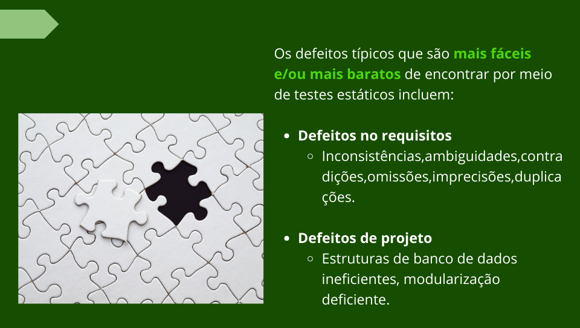
  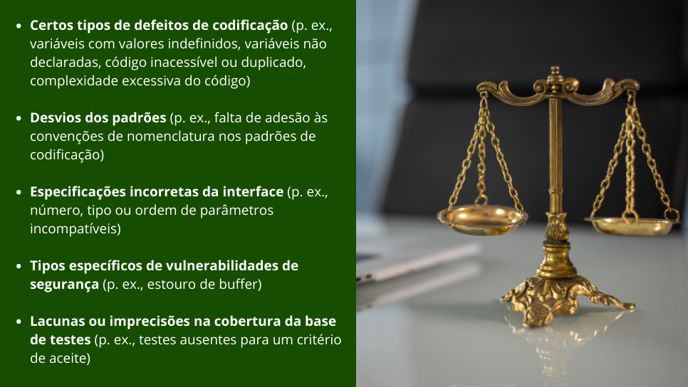

## 3.2.1 Benefícios do feedback antecipado e frequente dos stakeholders

O feedback antecipado e frequente permite a comunicação precoce de possíveis problemas de
qualidade, o feedback frequente dos stakeholders durante todo o SDLC pode evitar **mal-entendidos sobre os requisitos** e garantir que as alterações nos requisitos sejam compreendidas e implementadas mais cedo,

Isso permite que a equipe se concentre nos recursos que agregam mais valor aos
stakeholders e que têm o **maior impacto positivo** sobre os riscos identificados

## 3.2.2 Atividades do processo de revisão

A norma **ISO/IEC 20246** define um processo de revisão genérico que fornece um framework
estruturado, e técnicas de revisão.

O **tamanho** de muitos produtos de trabalho os torna **grandes demais** para serem cobertos por uma
única revisão. O processo de revisão pode ser invocado **algumas vezes** para concluir a revisão de todo o produto de trabalho.

As atividades no processo de revisão são:

- **Planejamento:** É definido o escopo da revisão, que inclui o objetivo, o produto de trabalho a ser revisado, as características de qualidade a serem avaliadas, as áreas a serem enfocadas, os critérios de saída, as informações de apoio, como padrões, o esforço e os prazos para a revisão.
- **Início da Revisão:** garantir que todos os participantes tenham acesso ao **produto de trabalho**, **entendam suas funções e responsabilidades** e recebam tudo **o que for necessário** para realizar a análise.
- **Revisão Individual:** Cada revisor realiza uma **revisão individual** para avaliar a qualidade do produto de trabalho sob revisão e para identificar **anomalias**, **recomendações** e **perguntas**, aplicando uma ou mais técnicas de revisão. Os revisores registram todas as **anomalias**, **recomendações** e **perguntas** identificadas.
- **Comunicação e Análise de problemas:** Como as **anomalias** identificadas durante uma
revisão não são **necessariamente** defeitos, todas essas **anomalias** precisam ser analisadas e
discutidas. Para cada uma encontrada, deve ser tomada uma decisão sobre seu **status**, **propriedade** e **ações necessárias**. Normalmente, isso é feito na reunião de revisão, na qual  também decidimos qual é o **nível de qualidade do produto de trabalho revisado** e quais **ações de acompanhamento** são necessárias. 
Pode ser necessária uma **revisão de acompanhamento** para concluir as ações.
- **Correção e relatório:** Para cada **defeito**, deve ser criado um **relatório de defeitos** para que as **ações corretivas possam ser acompanhadas**. Quando os critérios de saída forem atingidos, o produto de trabalho poderá ser aceito(DoR). Os resultados da revisão são relatados.

## 3.2.3 Funções e responsabilidades nas revisões

As revisões envolvem vários stakeholders, que podem assumir diversas funções. As principais, e suas responsabilidades são:

- **Gerente**: decide o que deve ser revisado e fornece recursos, como equipe e tempo para a
revisão
- **Líder da revisão**: assume a responsabilidade geral pela revisão, como decidir quem estará
envolvido e organizar quando e onde a revisão será realizada
- **Moderador** (também conhecido como **facilitador**): garante o andamento eficaz das reuniões
de revisão, incluindo mediação, gerenciamento de tempo e um ambiente de revisão seguro
no qual todos possam falar livremente
- **Relator** (também conhecido como **registrador**): reúne as anomalias dos revisores e registra
as informações da revisão, como decisões e **novas anomalias encontradas durante a reunião
de revisão**
- **Revisor**: realiza revisões. Um revisor pode ser alguém que esteja trabalhando no projeto, um **especialista** no assunto ou qualquer outra parte interessada
- **Autor**: cria e corrige o produto de trabalho em análise

**Outras funções mais detalhadas são possíveis.**

## 3.2.4 Tipos de revisão

  
  

Alguns tipos de revisão comumente usados são:

- **Revisão Informal:** As revisões informais não seguem um processo definido e não exigem um
resultado formal documentado. O principal objetivo é detectar anomalias.
- **Walkthrough:** Um passo a passo, **conduzido pelo autor**, pode servir  a muitos objetivos, como
**instruir os revisores**, **obter consenso**, detectar anomalias. Os revisores podem realizar uma revisão individual antes do passo a passo, mas isso não é obrigatório.
- **Revisão técnica:** Uma revisão técnica é realizada por **revisores tecnicamente qualificados** e
**liderada por um moderador**. Os objetivos de uma revisão técnica são **obter consenso** e tomar
decisões em **relação a um problema técnico**, mas também detectar anomalias.
- **Inspeção:** Como as inspeções são o **tipo mais formal de revisão**, elas seguem o processo
genérico completo (framework de revisão). O **objetivo principal** é encontrar o **número máximo de anomalias**. As métricas são coletadas e usadas para aprimorar o SDLC, **inclusive o processo de inspeção**. Nas inspeções, o autor não pode atuar como líder ou relator da revisão.

- **IMPORTANTE!**
    
    Todos os tipos de revisão, **EXCETO** a informal, tem por objetivo avaliar a
    qualidade e criar confiança no produto do trabalho, gerar novas ideias e motivar e capacitar os autores a melhorar.

## 3.2.5 Fatores de sucesso para revisões

- Definir objetivos claros e critérios de saída mensuráveis. A avaliação dos participantes nunca deve ser um objetivo;
- Escolher o tipo de revisão apropriado para atingir os objetivos determinados e se adequar ao tipo de produto de trabalho, aos participantes da revisão, às necessidades e ao contexto do projeto;
- Realizar revisões em pequenas partes, de modo que os revisores não percam a concentração
durante uma revisão individual e/ou a reunião de revisão (quando realizada);
- Fornecer feedback das revisões aos stakeholders e aos autores para que eles possam
melhorar o produto e suas atividades ;
- Fornecer tempo suficiente para que os participantes se preparem para a revisão;
- Apoio da gerência para o processo de revisão;
- Tornar as revisões parte da cultura da organização, para promover o aprendizado e o
aprimoramento dos processos;
- Fornecer treinamento adequado a todos os participantes para que eles saibam como
desempenhar suas funções;
- Facilitação de reuniões;

## 4.1 Visão Geral das técnicas de teste

  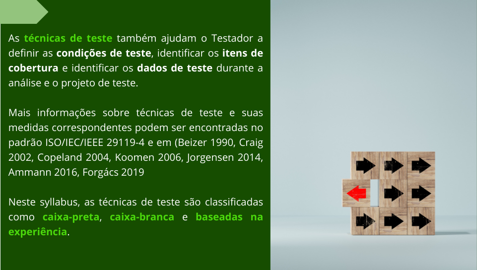
  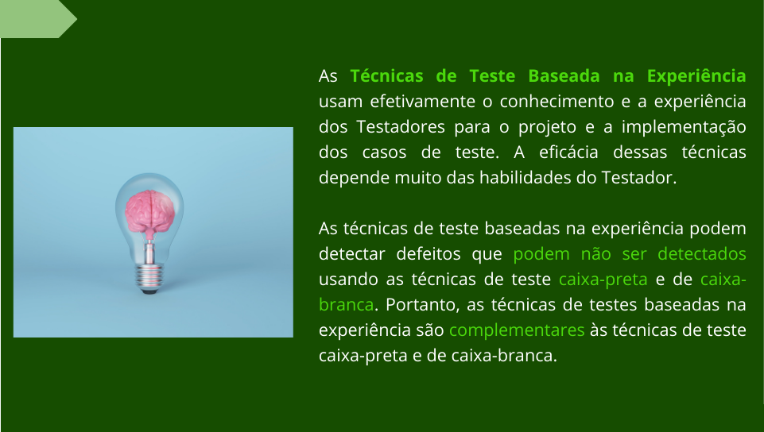

Mais resumos no Syllabus.

## 4.2 Técnicas de Teste Caixa-preta

As técnicas de **teste caixa-preta** comumente usadas e discutidas nas seções a seguir são:

- ***Particionamento de equivalência***(O Particionamento de Equivalência (EP) divide os dados em partições (conhecidas como partições de equivalência) com base na expectativa de que todos os elementos de uma determinada partição sejam processados da mesma forma pelo objeto de teste)
- ***Análise de valor de limite***(A BVA (Boundary Value Analysis) é uma técnica baseada na execução dos limites das partições de equivalência. Portanto, a BVA só pode ser usada para partições ordenadas. Os valores mínimo e máximo de uma partição são seus valores de limite.)
- ***Teste de tabela de decisão***(As tabelas de decisão são usadas para testar a implementação dos requisitos do sistema que especificam como diferentes combinações de condições resultam em diferentes resultados. As tabelas de decisão são uma forma eficaz de registrar lógicas complexas, como regras de negócios.)
- **`Teste de transição de estado`**(Um diagrama de transição de estado modela o comportamento de um sistema, mostrando seus possíveis estados e transições de estado válidas.)

## 4.2.1 Particionamento de Equivalência (EP)

> ***Tipos de EP:***
> 

- **Continua:**(dados de entrada podem ser qualquer número real dentro de um intervalo específico)
- **Discreta:**(discreta significa que é formada por elementos distintos desconexos entre si)
- **Ordenada:**(partições têm uma ordem natural ou sequência. Os elementos dentro de cada partição podem ser ordenados de acordo com algum critério)
- **Não ordenada:**(Estas partições não possuem uma ordem natural ou sequência, os elementos dentro de cada partição não precisam seguir uma ordem específica)
- **Finita:**(Estas partições têm um número limitado de elementos.)
- **Infinita:**(Estas partições têm um número ilimitado de elementos.)

Exemplos:

- **Continua**
    
    Em uma academia para ser um associado é necessário que a pessoa tenha idade entre 16 a 60 anos de idade
    
- **Discreta**
    
    Ligar para um homem **e** uma mulher em cada um dos 27 estados brasileiros.
    
- **Ordenada**
    
    Classificações de medalhas em uma competição (ouro, prata, bronze),Testar a faixa de temperatura entre -10°C e 50°C
    
- **Não ordenada**
    
    Tipos de frutas (maçã, banana, laranja). Não há uma ordem natural para organizar esses elementos.
    
- **Finita**
    
    Um conjunto limitado de valores, como os dias da semana.
    
- **Infinita**
    
    Um intervalo sem limites claros, como todos os números reais maiores que 0.
    

### Resumo

- **Contínuas e Ordenadas**: Sempre ordenadas devido à natureza contínua dos dados. Podem ser **finitas** ou **infinitas** dependendo do intervalo.
- **Discretas e Ordenadas ou Não Ordenadas**: Podem ter ou não uma sequência lógica, dependendo do contexto. Podem ser **finitas** ou **infinitas**.

**Partição válida:** Uma partição que contém valores válidos, aqueles que devem ser processados pelo objeto de teste, os quais a **especificação define seu processamento**.

**Partição inválida:** Valores inválidos, aqueles que devem ser **ignorados** ou **rejeitados** pelo objeto de teste ou como nenhum **processamento definido** na especificação do objeto de teste.

***ECC - Each Choise Coverage (**ou Árvore de decisão)*

> **O menor numero de testes de um problema, é sua maior quantidade de opções, exemplo:**
> 

Sorvete:

Embalagem: Casquinha, pote | 2

Sabor: Baunilha, Chocolate, Mista | 3

Menor número de testes: 3(devido o maior numero de opções)

## 4.2.2 Análise de Valor de Limite (BVA)

Para aplicação dessa técnica, é **necessário** que exista um EP(Particionamento de equivalência) e é necessário que as partições sejam **continuas e ordenadas**

Caso o BVA sendo utilizado seja de **2 valores**(ou 2 pontos) **preste atenção no enunciado**, e identifique se ele diz **acima** **ou abaixo**, que é pra onde você vai expandir o teste, caso ele não especifique **acima ou abaixo**, **sempre suba um ponto.**
Caso seja o BVA de 3 valores, basta pegar o valor limite e **decrementar** E **acrescentar um**.

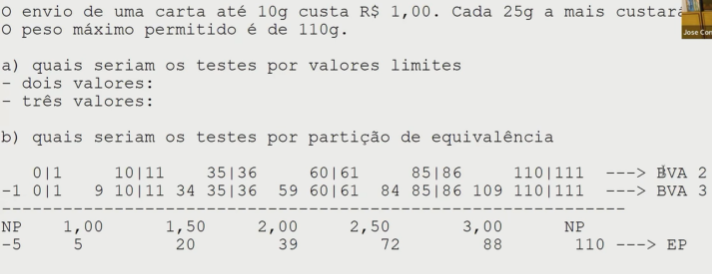

Lembrar que em **unidades de medidas** ou **outros valores** em que seja impossível(invalido) -0, também adicionar uma **partição inválida**.

https://edisciplinas.usp.br/pluginfile.php/1289345/mod_resource/content/0/Aula09_TesteFuncional-Estrutural-AnaliseMutantes.pdf

https://qualidadebr.wordpress.com/tag/particao-de-equivalencia-analise-do-valor-limite-tabela-de-decisao-teste-de-transicao-de-estados-teste-de-caso-de-uso/

## 4.2.3 Teste de Tabela de Decisão

As tabelas de decisão são usadas para testar a **implementação dos requisitos do sistema** que
especificam como diferentes **combinações de condições** resultam em **diferentes resultados**. As
tabelas de decisão são uma forma eficaz de registrar **lógicas complexas**, como **regras de negócios**.

> ***Tipos de Tabela de decisão:***
> 
- Tabelas de decisão de **entrada limitada**, todos os valores das condições e ações (**exceto os irrelevantes ou inviáveis**) são mostrados como valores **booleanos** (verdadeiro ou falso).
- Tabelas de decisão de **entrada** **estendida**, algumas ou todas as condições e ações também podem assumir **valores múltiplos** (p. ex., intervalos de números, partições de equivalência, valores discretos).

> ***Notação para condições***
> 
- "V" (verdadeiro) significa que a condição foi satisfeita.
- "F" (falso) significa que a condição não foi satisfeita.
- "-" significa que o valor da condição é irrelevante para o resultado da ação.
- "N/A" significa que a condição é inviável para uma determinada regra.

> ***Notação para ações***
> 
- "X" significa que a ação deve ocorrer
- Em branco significa que a ação não deve ocorrer

- **IMPORTANTE!**
    
    No teste de tabela de decisão, os **itens de cobertura** são as **colunas** que contêm combinações viáveis de condições
    

O **número máximo** de testes **EM TABELA DE DECISÃO** é a **multiplicação das possibilidades** de **cada condição**(variável)

Ex: **TABELA COMPLETA/EXPANDIDA**
Condições(Variáveis) | Partições |

-Cartão Válido       | V ou F 2x2 =4

-Senha Válida        | V ou F 4x2 =8

-Saldo >=100         | V ou F 

> *Número máximo de testes(**multiplicação das opções**):8*
> 

O **número mínimo** de testes **EM TABELA DE DECISÃO** é a **contagem** das condições +1

Ex: **Tabela reduzida/compactada**

Condições(Variáveis) | Regras de decisão(colunas)

-Cartão Válido       | V V V F

-Senha Válida        | V V F V

-Saldo >=100         | V F V V

> *Número mínimo (**Cartão, senha, saldo**) : 3+1=4*
> 

- **IMPORTANTE!**
    
    Caso uma condição tenha um valor de entrada que seja >2 (ou não booleano) será necessário contar todas as partições dessa condição, mais as demais condições
    
    Ex: Condições     | Partições(valores)
        Cartão válido | Cartão valido
                      | Cartão extraviado
                      | Cartão bloqueado
    
    Conta Mínimo: 3+2+1(Caminho feliz)=6

  
  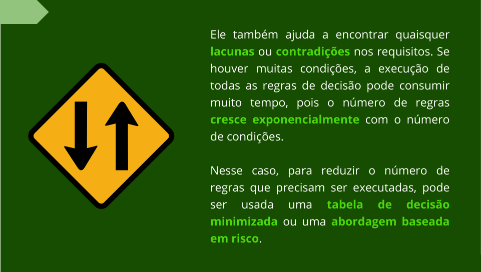

## 4.2.4 Teste de Transição de Estado

Um **diagrama de transição de estado** modela o comportamento de um sistema, mostrando seus
**possíveis estados** e **transições de estado válidas.**

Uma **transição de estado** é **iniciada por um evento**, em que podem **OU** não haver condições de proteção, e ações do software a partir desse evento.

A sintaxe comum de rotulagem de transição é a seguinte:

> evento [condição de proteção] / ação
> 

- **Condição de proteção:** Uma condição booleana que precisa ser satisfeita para o evento ocorrer.
    
    > Ex:
    
    **Estados:** "Cartão Inserido", "Autenticando", “Transação”, “Cartão Ejetado”.
    > 
    > 
    > **Transição**: De "Cartão Inserido" para "Autenticando".
    > 
    > - **Evento de Entrada**: O usuário digita o PIN.
    > - **Condição de Proteção**: O cartão inserido é válido.
    > - **Descrição**: O ATM só passará para o estado de autenticação **se** o cartão inserido for reconhecido como válido (condição de proteção), além de o PIN ter sido digitado.
    

O **número máximo** de **CASOS DE TESTE**, em um **diagrama de transição de estado**, é a contagem das setas(transições)

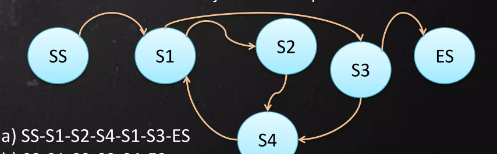

O **número mínimo** de **CASOS DE TESTE**, em um **diagrama de transição de estado**, é a contagem das setas **NO ÚLTIMO ESTADO, ou percorrendo todas as transições.**

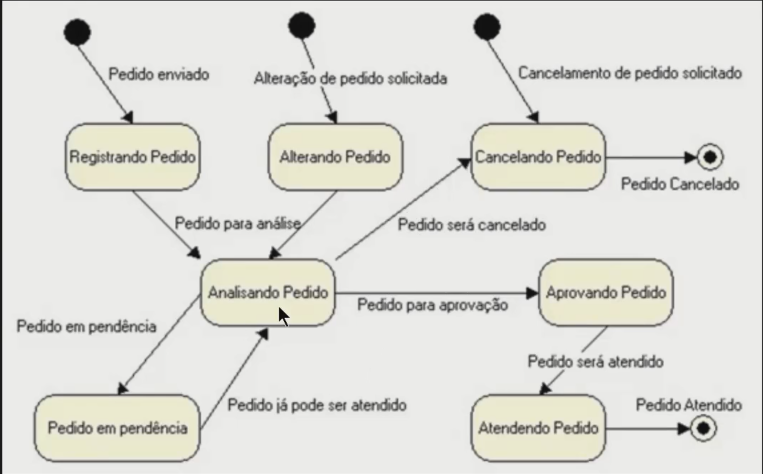

Observar as setas que chegam nos penúltimos estados, também PODE ajudar.

Uma **tabela de estados** é um modelo equivalente a um diagrama de transição de estados. 

Ao contrário do diagrama de transição de estados, a tabela de estados mostra **explicitamente** as **transições inválidas**, que são representadas por células vazias.

- Linhas = Estados
- Colunas = Eventos
- Entradas(células) = Transições de estado(juntamente com o estado de destino)

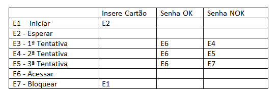

TABELA DE ESTADOS

> ***Tipos de critérios de cobertura em teste de transição de estado***
> 

- Na **cobertura de todos os estados**, os itens de cobertura são os estados. Para atingir 100% de cobertura de todos os estados, os casos de teste devem garantir que **todos os estados sejam visitados**
- Na **cobertura de transições válidas** (***0-switch***), os itens de cobertura são transições válidas **únicas**. Para atingir 100% de cobertura de transições válidas, os casos de teste devem executar todas as transições válidas.
- Na **cobertura de todas as transições**, os itens de cobertura são **todas** as transições mostradas em uma **tabela de estados**. Para atingir 100% de cobertura, os casos de teste devem executar todas as transições válidas e as **transições inválidas**
Uma **transição inválida** por caso de teste, para evitar o **mascaramento de falhas**(*um defeito impedir outro de ocorrer*)

- **IMPORTANTE!**
    
    O nível de cobertura do teste está relacionado ao número de **transições consecutivas** cobertas. *N-switch*
    Se cada **transição valida for testada unicamente**, alcançaremos “cobertura de 0-switch”. A cobertura de switch 0 significa que não nos concentramos em testar **transições consecutivas**(*apenas testar uma transição de estado)*. 
    Se as **sequências de duas transições** forem testadas, então todas as **combinações de duas transições consecutivas** são testadas, alcançamos “cobertura de 1-switch”
    

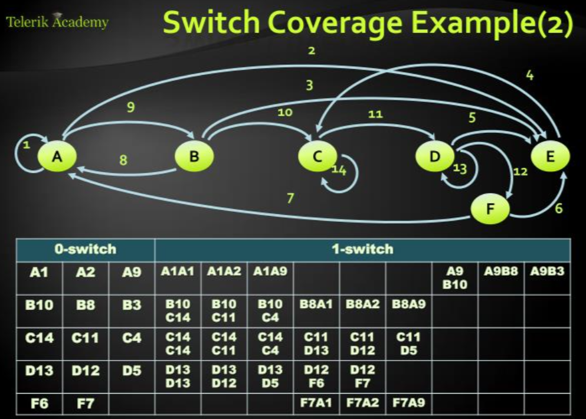

## 4.3 Técnicas de Teste Caixa-Branca

As técnicas de **teste caixa-branca** comumente usadas e discutidas nas seções a seguir são:

- Teste de instruções (Testes dos laços condicionais do código e do **for**)
- Teste de ramificação(Teste das diferentes decisões dos laços de condição)

## 4.3.1 Teste de Instrução e Cobertura de Instrução

No teste de instrução, o objetivo é projetar casos de teste que exercitem as instruções no código até que um nível **aceitável de cobertura** seja alcançado. 

Os itens de cobertura são as **instruções executáveis**. Quando a cobertura de 100% das instruções é alcançada, está garantido que **todas as instruções executáveis** no código tenham sido executadas pelo menos uma vez. Em particular, isso significa que
**cada instrução com um defeito será executada**, o que pode causar uma falha que demonstre a
presença do defeito. 

No entanto, a cobertura de 100% de instrução não garante que toda a lógica de decisão tenha sido testada, pois, por exemplo, ela pode não executar todas as decisões do código.

## 4.3.2 Teste de Ramificação e Cobertura de Ramificação

Uma ramificação é uma **transferência de controle** entre dois nós no gráfico do **fluxo de controle**, que mostra as **possíveis** **sequências** nas quais as instruções do código-fonte são executadas no objeto de teste. 

A transferência de controle pode ser:

- **incondicional** (ou seja, código em linha reta)
- **condicional** (ou seja, um resultado de decisão, if/else, switch, loop).

As ramificações condicionais normalmente correspondem a um resultado verdadeiro ou falso de uma **decisão** "if...then", um **resultado de uma instrução** “switch/case” ou uma **decisão de sair ou continuar** em um “loop

- IMPORTANTE!
    - Na regra do C, uma instrução dentro de outra instrução **não conta**, independente se for(if,for,switch) apenas as ramificações contam
    
    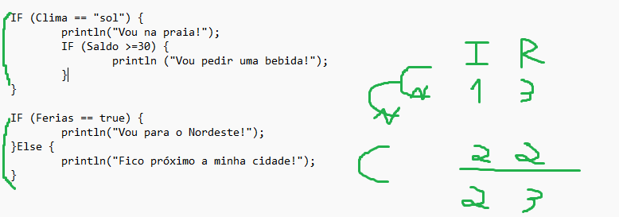
    
    - **A Ramificação é ≥= a instrução**. Isso significa que qualquer conjunto de casos de teste que atinja 100% de cobertura de ramificação também atinge 100% de cobertura de instrução (mas não vice-versa).

    
## 4.3.3 O valor do Teste Caixa-Branca

